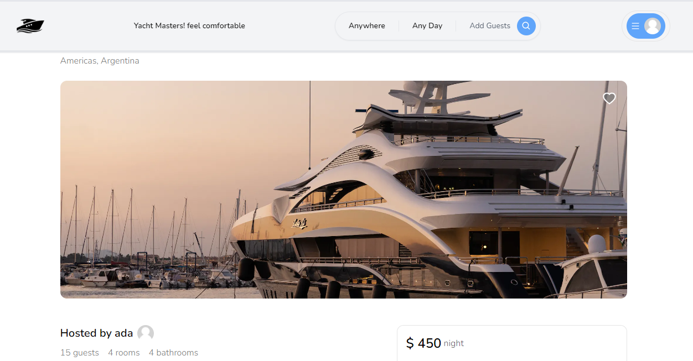

# Project Description

This is a re-design of the Netflix web-app...Built with next js(TypesCript) and tailwind-css. Firebase is used for userAuthentication.

## View demo on

https://yacht-rose.vercel.app

# Screenshots

## Getting Started

Clone this repository

git clone https://github.com/SamYusuf101/yacht.git

## Install packages

npm install\
npm run dev
Open [http://localhost:3000](http://localhost:3000) with your browser to see the result.

## Star, Fork, Clone & Contribute

Feel free to contribute to this repository

